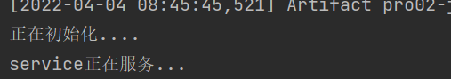

### 1、设置编码

<font color='red'>需要注意的是，设置编码这一句需要放在获取参数语句之前。</font>


### 2、Servlet 的继承关系

```  txt
1、继承关系
javax.servlet.Servlet接口
	javax.servlet.GenericServlet抽象类
		javax.servlet.http.HttpServlet抽象子类
2、相关方法
javax.servlet.Servlet接口：
	void init(config)  - 初始化方法
	void service(request, response)  -  服务方法
	void destory()  - 销毁方法
javax.servlet.GenericServlet抽象类
	void service(resquest, response)  -  仍然是抽象的
javax.servlet.http.HttpServlet抽象子类
	void service(resquest, response)  - 不是抽象的
		1、String method = req.getMethod();	- 获取请求的方式
		2、各种if判断，根据请求的方式不同，决定调用不同的do方法
		3、在HttpServlet中，do方法都差不多
```

小结： 

- 继承关系：HttpServlet	-> GenericServlet	->	Servlet
- Servlet中的核心方法： init()、service()、destroy()
- 服务方式：当有请求过来，service方法会自动响应（其实是tomcat容器调用的）
  - 在HttpServlet中我们会去分析请求的方式到底是get、post、head还是delete等等。
  - 然后再决定调用哪个do方法
  - 那么再HttpServlet中这些do方法默认都是405的实现风格-要我们的子类去实现对应的方法，否则就会报405
  - 因此，我们再新建Servlet时，才会去考虑请求方法，从而决定重写哪个do方法。

### 3、Servlet的生命周期

​	1、生命周期：从出生到死亡的过程，对应Servlet中的三个方法：init()、service()、destroy()

​	2、默认情况下：

​			第一次接受请求的时候，这个Servlet会进行实例化（通过构造方法）、初始化(inti方法)、然后进行服务(service方法)

​			从第二次请求开始，每一次都是服务

​			当容器关闭时，其中的所有Servlet示例会被销毁

​	3、通过案例发现，servlet实例tomcat只会创建一个，所有的请求都是这个实例去响应。默认情况下，第一次请求时，tomcat才会去实例化、初始化、然后再服务。这样的好处是提高系统的启动速度。这样的缺点是第一次请求时，耗时较长。





4、Servlet初始化时机：

​	-默认是第一次接收请求的时候启动实例化、初始化

​	-可以通过<load-on-startup>来设置servlet启动的先后顺序，数字越小，启动越靠前，最小值0.

5、servlet 在容器中是单例的，线程不安全的

```txt
单例：所有的请求都是同一个实例去响应
线程不安全：一个线程需要根据这个实例中的某个成员变量去做逻辑判断，但是中间某个时机，另外一个线程对这个成员变量做了修改，导致错误。
我们已经知道了servlet是线程不安全的，启发是：尽量不要再servlet中定义成员变量，如果不得不定义成员变量，那么不要去：①不要修改成员变量的值、②不要根据成员变量做一些逻辑值判断。
```

### 4、Http协议


### 5、会话